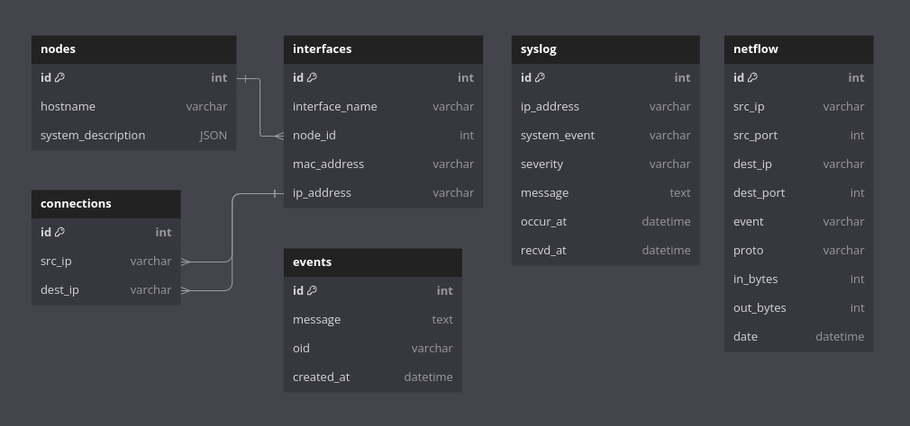

# Tool for secure automatic network topology creation

---

# 1. Summary

Building an **automated network discovery tool** for SCADA networks that maintains an updated topology map, tracks real-time changes, and ensures network administrators can quickly identify and address issues. The tool enhances network visibility, security, and responsiveness through real-time monitoring and notifications.

# 2. Solution Architecture


# 3. Technical Implementation

## **3.1 SCADA Network**

A SCADA Network ( Supervisory Control and Data Acquisition Network ) is extended across thousands of kilometers comprising multiple devices including sensors, routers and switches. It is primarily a system used to monitor and control industrial processes. Our Tool can connect to it via a physical or a virtual interface.

## **3.2 Network Data Collection and Processing**

## **3.2.1 Protocols Used**

- **EIGRP (Enhanced Interior Gateway Routing Protocol)** offers detailed routing information, dynamic path selection, traffic balancing and scalability along with fast-convergence. It efficiently updates routing tables on real-time network conditions and **enhances security** by minimizing the reliance on discovery-based protocols like CDP and LLDP, making it ideal for critical infrastructures such as SCADA systems.  
-   
- **SNMPv3 (Simple Network Management Protocol version 3\)** provides advanced security features like authentication, encryption, and access control for effective network management. It ensures **data integrity** and **confidentiality**, making it ideal for monitoring critical infrastructures like SCADA systems while minimizing vulnerabilities present in earlier SNMP versions.

## **3.2.2 Network Topology Creation**

**Snmpv3 Polling** is used to identify the device, query interface information and routing tables. It is then combined with EIGRP neighbors data to form the network and determine physical connections, and store the information in the PostgreSQL Database.  
This is performed using a cron-job, which uses the **snmpwalk** library in debian based linux distributions.

**Example** : Polling a newly added device for information

```bash
snmpwalk -v3 -l <security_level> -u <username> -a <auth_protocol> -A <auth_password> -x <priv_protocol> -X <priv_password> -Oqv <target_ip> <OID>
```

- OID’s Required  
  - 1.3.6.1.4.1.9.10.186.1.2.1.1 \- EIGRP Neighbors IP’s  
  - 1.3.6.1.2.1.1 \- System Description  
  - 1.3.6.1.2.1.2.2 \- Interfaces Information  
  - 1.3.6.1.2.1.4.24.4 \- Routing Tables  
- Security level  
  - authPriv \- authentication \+ encryption (recommended)  
  - noAuthPriv \- no authentication \+ encryption  
  - noAuthnoPriv \- no authentication \+ no encryption  
- Privacy Protocol  
  - AES \- Advanced Encryption Standard (recommended)  
  - DES \- Data Encryption Standard

## **3.2.3 Real-Time Network Monitoring**

**Snmpv3 Traps** are set-up in the devices, hence they send notifications whenever the concerned router / switch undergoes a change for example a Link Up / Down event, Authentication Failure, Reboot, etc.  
These are a secure and efficient way of getting real-time status data from the SCADA network. These event-driven traps are intercepted using a trap receiver server, which uses the **pysnmp** library, to receive traps, the received information is parsed using a custom OID-parser script, and passed on to the socket-server.

**Example** : Link Up/ Down Event  

```plainText
SNMP Version: 3
Security Level: authPriv
User: snmpuser

SNMP Trap PDU:
- Uptime: 123456789 (14 days, 6:56:07.89)
- OID: IF-MIB::linkDown (1.3.6.1.6.3.1.1.5.3)
- Enterprise OID: SNMPv2-SMI::enterprises.9.9.116 (1.3.6.1.4.1.9.9.116)
- Agent Address: 192.168.1.1

Variables:
1. IF-MIB::ifIndex.2 = INTEGER: 2
2. IF-MIB::ifAdminStatus.2 = INTEGER: up(1)
3. IF-MIB::ifOperStatus.2 = INTEGER: down(2)
```
## 

## **3.2.4 Logging Data Capture**

**Syslog data** is vital for identifying network issues such as device failures, misconfigurations, and security breaches, aiding in effective troubleshooting. In this project, logs from SCADA network devices are securely streamed to a **central server** using **TLS and rsyslog**.  
All logs are stored in a network.log file. A cron-job periodically parses the file using a custom syslog-parser module and uploads the data to a PostgreSQL database, while the original file is backed up to AWS S3. Logs are auto-categorized by the router based on severity (0-7), with 0 being the highest priority, helping prioritize critical events.  
**Example Logs**: 

```plainText
Sep 29 12:31:10 Router1: %LINK-3-UPDOWN: Interface GigabitEthernet0/1, changed state to down
Sep 29 12:33:00 Router1: %LINK-5-CHANGED: Interface GigabitEthernet0/2, changed state to up
Sep 29 12:30:45 Router1: %SYS-EMERG: System is unable to allocate memory, immediate action required!
```

**NetFlow data** is crucial for monitoring network traffic patterns and detecting anomalies such as bandwidth spikes or potential security threats. In this project, NetFlow logging has been implemented on routers, with flow data sent to a central server. The data is collected using **nfcapd** and parsed at regular intervals using **nfdump** and a custom netflow-parser module in a cron-job. Parsed data is uploaded to a SQL database for analysis, while the raw flow records are archived for future reference. This setup provides valuable insights into traffic behavior, helping administrators optimize performance and quickly identify abnormal activity. 

**Example Data:**

```plainText
| Timestamp           | Src IP        | Dst IP        | Src Port | Dst Port | Protocol | Bytes  | Packets | Flow Duration (ms) |
|---------------------|---------------|---------------|----------|----------|----------|--------|---------|--------------------|
| 2024-09-28 14:32:01 | 192.168.1.10  | 10.0.0.20     | 443      | 12345    | TCP      | 2048   | 8       | 1500               |
| 2024-09-28 14:32:03 | 192.168.1.5   | 10.0.0.25     | 80       | 55555    | TCP      | 10240  | 50      | 3000               |
| 2024-09-28 14:32:05 | 172.16.0.12   | 8.8.8.8       | 53       | 0        | UDP      | 512    | 2       | 20                 |
| 2024-09-28 14:32:10 | 192.168.1.15  | 172.16.0.100  | 22       | 56789    | TCP      | 4096   | 12      | 2000               |
| 2024-09-28 14:32:12 | 192.168.1.20  | 192.168.1.30  | 80       | 54321    | TCP      | 3072   | 15      | 2500               |
| 2024-09-28 14:32:14 | 192.168.1.50  | 10.0.0.40     | 443      | 12346    | TCP      | 6144   | 25      | 2200               |
| 2024-09-28 14:32:20 | 192.168.1.5   | 172.16.0.12   | 80       | 44444    | TCP      | 15360  | 100     | 4000               |
| 2024-09-28 14:32:25 | 172.16.0.50   | 10.0.0.20     | 8080     | 54322    | TCP      | 2048   | 5       | 1000               |
```
## **3.3 Database**

**PostgreSQL** serves as the central database for storing parsed network data from SNMP, syslog, and NetFlow. It efficiently handles structured data, allowing for quick querying and retrieval of network topology, event logs, and traffic patterns for real-time analysis.

**AWS S3** is used for *secure backup and archival* of raw logs and flow data. This ensures long-term storage and accessibility, providing a reliable fallback for auditing, compliance, or future data analysis.

**Data Model**  
****

## **3.4 Backend Server**

**Cron-Manager** is responsible for running all the cron-jobs in a set interval continuously to make sure that all the latest information received from the network is parsed and uploaded to the database in a timely manner.

**FastAPI Server Module** is responsible for serving all the latest updated data from the PostgreSQL database to the Web Client

**WebSocket Server Module** is responsible for parsing the snmpV3 traps and forwarding them to the WebClient in real-time.

## **3.5 User Interface**

**Network Visualiser** is used to visualize the entire SCADA network with all the physical connections using the D3.js Library.

**Log Explorer** is used to get deeper insights into the network, by using filtering mechanisms, based on severity of logs and the incident itself.

**Netflow Heatmap** is used to monitor the traffic handled by each router along with the specifics, it helps in pointing out connections that might be stressed or been causing data leaks in the network.

**Real-Time Notifications** is used to alert the network administrator about any event caused in any part of the SCADA Network using a persistent connection with Web Sockets.

## **3.6 Unauthorized Devices Handling**

- The Network administrator is informed that a new device is added to the network, along with whatever details are available.  
- If the Device is malicious, The  administrator, can disable its access to the network, by turning the interface down which it was connected to automatically handling the threat swiftly.

```bash
snmpwalk -v3 -l authPriv -u <username> -a SHA -A <auth_password> -x AES -X <priv_password> <device_ip> IF-MIB::ifAdminStatus
```

# 4. Design Decisions and Tradeoffs

## **4.1 Bandwidth Management with QoS**

In our SCADA network, the real-time capture of logs and network events, including SNMP traps and syslog messages, can result in significant bandwidth usage. Without proper management, this traffic could overwhelm the network, leading to delays in processing critical alerts.

QoS was implemented to prioritize monitoring traffic over non-critical data, ensuring that logs and live event notifications are transmitted with minimal delay. By assigning higher priority to SNMP and syslog traffic, we prevent congestion from impacting the timely delivery of important network updates. This ensures continuous, real-time monitoring without bandwidth bottlenecks, especially during periods of high network activity.

# 5. **Setup Guide (Linux)**

## 5.1 Installation Guide

Pre-Requisites \- Python v3.8+, NodeJs \- v20+

```bash
sudo apt update 
sudo apt install snmp snmpd snmptrapd -y
sudo apt install rsyslog -y
sudo systemctl start rsyslog
sudo apt install nfdump -y
sudo add-apt-repository ppa:gns3/ppa -y
sudo apt update
sudo apt install gns3-server gns3-gui -y
```

## 5.2 Simulating a Test Network on a GNS3 Environment

- Download the Cisco 3750 Router Image  
- Importing the Router Image in GNS3  
  - Edit \> Preferences \> IOS routers \> New \>   
  - \[Select the Router Image\] \> Save  
- Add Routers to the Project  
- Configure the Routers and Create Connections  
  - Sample Configuration

```bash
configure terminal
interface FastEthernet 0/0
ip address <ip_address> <subnet_mask>
no shutdown
exit
# repeat for all interfaces
exit
```

## 5.3 Enabling EIGRP in the Network

```bash
configure terminal
router eigrp 100
network <connected_ip> <reverse_wildcard_mask> # do it for all connections
exit
exit
```

## 5.4 Creating a snmpV3 user

```bash
configure terminal
snmp-server user <username> <groupname> v3 auth md5 <auth-password> priv aes <priv-password>
snmp-server user <snmp_user_username> snmpgroup v3 auth md5 <auth-password> priv aes <priv-password>
exit
end
```

## 5.5 Connecting to the Test Environment

- Setup a Tap Interface on your Local Machine  
  - Creating a Tap Interface

```bash
sudo ip tuntap add dev tap0 mode tap
sudo ip link set dev tap0 up
sudo ip addr add 10.0.0.1/24 dev tap0
```

    

  - Configure your default route to reference the tap interface

```bash
sudo ip route add default dev tap0
```

- Import a Cloud Node into your GNS3 Network  
  - Select the created Tap Interface in the Cloud Node  
  - Setup the IP address of the tap interface as a fallback on each of the network devices, for it to be able to communicate outside of the network.

```bash
configure terminal
ip route 0.0.0.0 0.0.0.0 10.0.0.1
exit
```

## 5.6 Enabling snmpV3 traps on a cisco-router

```bash
configure terminal
snmp-server traps enable
snmp-server host <tap-interface-ip-address> version 3 auth <username>
exit
```

## 5.7 Enabling syslog capture

```bash
configure terminal
logging host <server_ip> transport tcp port 6514
logging trap informational
exit
```

## 5.8 Enabling netflow data capture

```bash
configure terminal
ip flow-export destination <collector_ip> 9995
ip flow-export version 9
exit
```